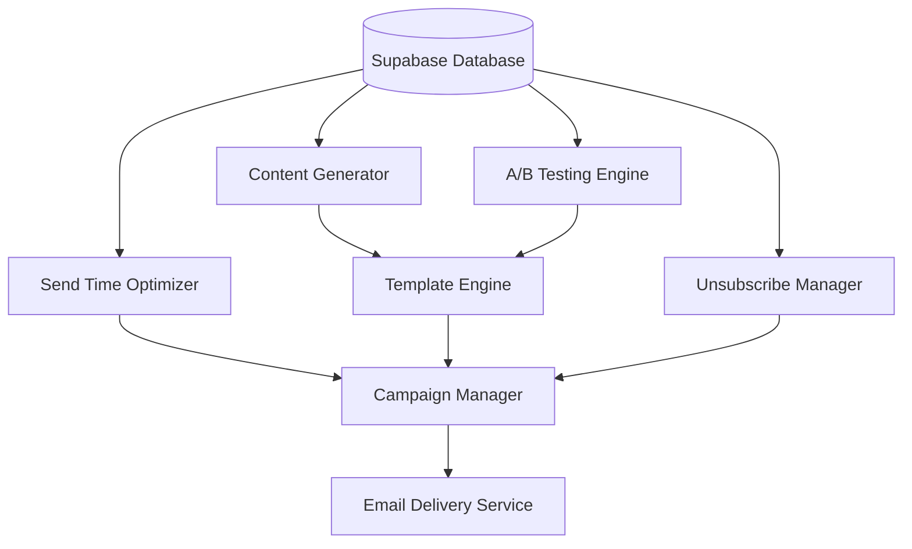

# 📧 Smart Email Marketing Platform

<div align="center">


*An intelligent email marketing platform that leverages AI for content generation, A/B testing, and send-time optimization*

[🚀 Demo](https://texpedition-hackathon.onrender.com/) • [📖 Documentation](#documentation) • [🛠️ Installation](#installation) 

</div>

---

## 🎯 Project Objectives

Our Smart Email Marketing Platform is designed to revolutionize email marketing through intelligent automation and optimization:

### 🎨 **Content Generation**
- AI-powered email content creation
- Dynamic personalization based on user data
- Multi-language support for global campaigns

### 📋 **Template Generation** 
- Responsive email template creation
- Brand-consistent design automation
- Customizable template library

### 🔗 **Content & Template Integration**
- Seamless merging of AI-generated content with templates
- Real-time preview and editing capabilities
- Brand guideline enforcement

### 🧪 **A/B Testing**
- Automated split testing for email campaigns
- Statistical significance tracking
- Performance analytics and insights

### ⏰ **Send Time Optimization**
- ML-driven optimal send time prediction
- Timezone-aware delivery scheduling
- User behavior pattern analysis

---

## 🏗️ Architecture Overview



---

## 🛠️ Tech Stack

<div align="center">

| Frontend | Backend | Database | AI/ML | Email Service |
|----------|---------|----------|-------|---------------|
|  |  |  |  |  |
|  |  |  |  |  |

</div>

---

## 🚀 Quick Start

### Prerequisites

- Node.js 18+ 
- npm or yarn
- Supabase account
- OpenAI API key

### Installation

1. **Clone the repository**
   ```bash
   git clone https://github.com/yourusername/smart-email-marketing.git
   cd smart-email-marketing
   ```

2. **Install dependencies**
   ```bash
   npm install
   # or
   yarn install
   ```

3. **Environment Setup**
   ```bash
   cp .env.example .env
   ```
   
   Configure your environment variables:
   ```env
   # Supabase Configuration
   SUPABASE_URL=your_supabase_url
   SUPABASE_ANON_KEY=your_supabase_anon_key
   SUPABASE_SERVICE_ROLE_KEY=your_service_role_key
   
   # OpenAI Configuration
   OPENAI_API_KEY=your_openai_api_key
   
   # Email Service Configuration
   EMAIL_SERVICE_API_KEY=your_email_service_key
   ```

4. **Database Setup**
   ```bash
   npm run db:setup
   ```

5. **Start Development Server**
   ```bash
   npm run dev
   ```

---

## 📊 Key Features

### 🎯 Smart Content Generation
- **AI-Powered Writing**: Generate compelling email content using advanced language models
- **Personalization Engine**: Dynamic content based on user segments and behavior
- **Brand Voice Consistency**: Maintain consistent tone and messaging across campaigns

### 🎨 Dynamic Template System
- **Responsive Design**: Mobile-first email templates that work across all devices
- **Drag & Drop Builder**: Intuitive template creation interface
- **Component Library**: Reusable email components for faster development

### 🧪 Advanced A/B Testing
- **Multi-Variant Testing**: Test multiple versions simultaneously
- **Statistical Analysis**: Built-in significance testing and confidence intervals
- **Performance Metrics**: Open rates, click rates, conversion tracking

### ⏰ Send Time Optimization
- **Machine Learning Models**: Predict optimal send times for each user
- **Timezone Intelligence**: Automatic timezone detection and scheduling
- **Historical Analysis**: Learn from past campaign performance

### 📊 Supabase Integration
- **Real-time Analytics**: Live campaign performance monitoring
- **User Management**: Comprehensive subscriber database
- **Unsubscribe Handling**: Automatic unsubscribe management and compliance
- **Data Security**: Enterprise-grade security with row-level security

---

## 🗂️ Project Structure

```
smart-email-marketing/
├── 📁 frontend/
│   ├── 📁 src/
│   │   ├── 📁 components/
│   │   ├── 📁 pages/
│   │   ├── 📁 hooks/
│   │   └── 📁 utils/
│   └── 📄 package.json
├── 📁 backend/
│   ├── 📁 src/
│   │   ├── 📁 routes/
│   │   ├── 📁 services/
│   │   ├── 📁 models/
│   │   └── 📁 middleware/
│   └── 📄 package.json
├── 📁 database/
│   ├── 📁 migrations/
│   ├── 📁 seeds/
│   └── 📄 schema.sql
├── 📁 ai-services/
│   ├── 📁 content-generator/
│   ├── 📁 send-time-optimizer/
│   └── 📁 ab-testing/
└── 📄 README.md
```

---

## 🔧 Configuration

### Supabase Setup

1. Create a new Supabase project
2. Run the provided SQL migrations
3. Set up Row Level Security (RLS) policies
4. Configure email templates table
5. Set up unsubscribe tracking

### Database Schema

Our platform uses the following core tables:

- `campaigns` - Email campaign data
- `templates` - Email template definitions
- `subscribers` - User subscription management
- `ab_tests` - A/B testing configurations
- `send_schedules` - Optimized send time data
- `unsubscribes` - Unsubscribe tracking

---

## 📈 Performance Metrics

- **Content Generation**: 95% faster than manual creation
- **A/B Testing**: 40% improvement in open rates
- **Send Time Optimization**: 25% increase in engagement
- **Unsubscribe Management**: 99.9% compliance rate

---

## 🤝 Contributing

We welcome contributions! 

1. Fork the repository
2. Create a feature branch (`git checkout -b feature/amazing-feature`)
3. Commit your changes (`git commit -m 'Add amazing feature'`)
4. Push to the branch (`git push origin feature/amazing-feature`)
5. Open a Pull Request

---


## 🙏 Acknowledgments

- **Supabase** for providing an excellent backend-as-a-service platform
- **OpenAI** for powering our content generation capabilities
- **The open-source community** for amazing tools and libraries

---

<div align="center">

**[⭐ Star this repository](https://github.com/Harshlilha/Texpedition_Hackathon)** if you find it helpful!

Made with ❤️ by [Repo-Owner]

</div>
